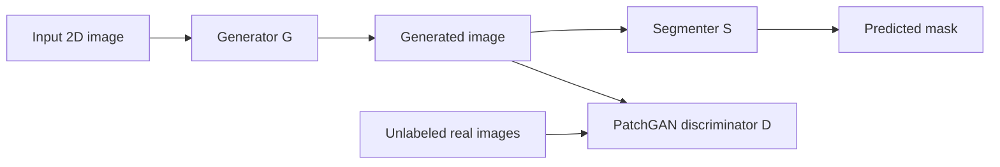

# Architecture

## Model Flow

During training, `D` encourages generated images to remain realistic while `S` learns segmentation on both original and generated images. Unlabeled images add ICT-style consistency regularization.

## Code Boundaries

- `src/grn/data`: dataset loading and image/mask transforms.
- `src/grn/models`: generator, discriminator, and MONAI UNet segmenter factory.
- `src/grn/training`: semi-supervised training loop and losses.
- `src/grn/inference`: predictor, metrics, and overlay rendering.
- `src/grn/api`: FastAPI inference service.

The original scripts are kept as historical references, while the package provides the engineering-ready surface.
